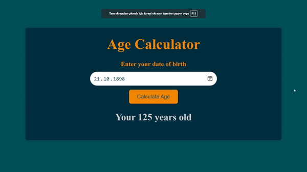

# Yaş Hesaplama

Bu basit bir yaş hesaplama web uygulamasıdır. Kullanıcıların doğum tarihlerini girmelerine izin verir ve mevcut tarihe göre yaşlarını hesaplar.

## Kullanılan Teknolojiler:

- HTML
- CSS
- JavaScript

## Dosya Yapısı:

- `index.html`: Web sayfasının yapısını içeren ana HTML dosyası.
- `style.css`: HTML elementlerine stil vermek için kullanılan CSS dosyası.
- `main.js`: Yaş hesaplama işlemine etkileşim eklemek için kullanılan JavaScript dosyası.

## Kullanım:

1. Bir web tarayıcısında `index.html` dosyasını açın.
2. Giriş alanına doğum tarihinizi girin.
3. "Yaşı Hesapla" düğmesine tıklayın.
4. Yaşınız düğmenin altında görüntülenecektir.

## Ekran Görüntüsü:



```

```
